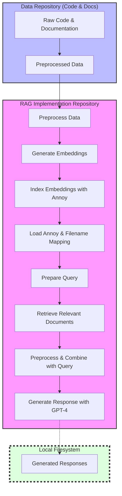
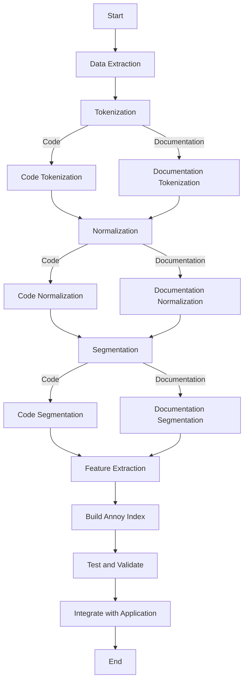
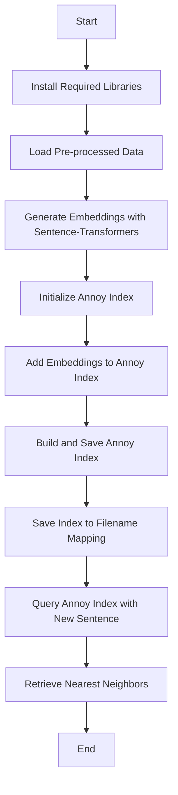

# Getting RAG running locally

_This document was generated primarily by GPT-4o._

Adding a Retrieval-Augmented Generation (RAG) implementation to your workflow, especially with a local embeddings provider, is an advanced and exciting step towards enhancing your project's capabilities. This involves integrating a system that retrieves relevant documents or data (using embeddings) and then generates responses based on both the retrieved information and the direct input. Given your background and requirements, here's a structured approach to achieve this:

### 1. Understanding RAG

First, ensure you have a solid understanding of how RAG works. RAG combines the power of pretrained language models (like those from GPT or BERT) with a retrieval system (often based on dense vector embeddings) to generate responses that are informed by a broader context or specific knowledge base.

### 2. Selecting an Embeddings Provider

For a local embeddings provider, you might consider options like Elasticsearch with dense vector support, FAISS (Facebook AI Similarity Search), or Annoy (Approximate Nearest Neighbors Oh Yeah) by Spotify. These systems allow you to store and retrieve embeddings efficiently. You'll need to:

- **Generate Embeddings**: Convert your dataset or knowledge base into embeddings. This step might involve using models like Sentence-BERT or similar to encode your text data into high-dimensional vectors.
- **Index Embeddings**: Use your chosen embeddings provider to index these vectors. This involves setting up the provider locally and creating an index for your embeddings.

### 3. Integration with Your Project

- **Data Preparation**: Ensure your data is in a format suitable for both embedding generation and retrieval. This might involve preprocessing steps like tokenization, normalization, and possibly segmentation.
- **Embedding Generation and Indexing**: Use a script or a pipeline to process your data, generate embeddings, and index them in your local embeddings provider.
- **Retrieval Mechanism**: Implement a retrieval mechanism that queries the embeddings provider based on input queries (or context) to fetch relevant documents or data points.
- **Augmentation and Generation**: Integrate the retrieval mechanism with your language model (e.g., GPT-4). This involves modifying the input to the language model to include retrieved information, thereby augmenting the generation process.

### 4. Software and Libraries

- **Language Model**: Utilize the OpenAI GPT API or a locally hosted model if you have access and resources.
- **Embeddings Generation**: Libraries like `sentence-transformers` can be used for generating embeddings.
- **Local Embeddings Provider**: Set up and utilize Elasticsearch, FAISS, or Annoy as your local embeddings provider. Each has its own setup and integration libraries (e.g., `elasticsearch-py`, `faiss`, `annoy`).
- **Integration**: Develop a custom integration layer that ties together the embeddings retrieval and the language model generation. This might involve custom code to handle the logic of combining retrieved content with the input query and formatting it for the language model.

### 5. Testing and Iteration

- **Prototype**: Start with a small subset of your data to prototype the entire RAG process. This allows you to debug and refine your approach without the overhead of processing your entire dataset.
- **Evaluation**: Evaluate the performance of your RAG system in terms of both retrieval accuracy and the quality of generated responses. You might need to adjust your embeddings model, retrieval thresholds, or the way retrieved information is used by the language model.

### 6. Deployment

Once you're satisfied with the prototype's performance, scale up your implementation to handle your full dataset. Ensure your local embeddings provider is configured to handle the load and that your integration layer is optimized for performance.

### 7. Documentation and Maintenance

Document your RAG implementation process, including data preparation steps, configurations for your embeddings provider, and custom code for integration. Regularly review and update your embeddings index as your data or knowledge base evolves.

This approach requires a blend of skills in natural language processing, software development, and system architecture. Given your expertise, you should be well-equipped to tackle the challenges of integrating RAG into your project."

## Summary

Here's a mermaid diagram that encapsulates the end-to-end local setup, including the separate code repositories for the RAG implementation and the repository being embedded.



#### Explanation of the Diagram:

- **Data Repository (Code & Docs)**: This is where your raw code and documentation reside. The preprocessing step transforms this raw data into a format suitable for embedding generation.

- **RAG Implementation Repository**: Contains the logic for the entire RAG process, including:

  - **Preprocess Data**: Initial preparation of data from the data repository.
  - **Generate Embeddings**: Converts preprocessed data into embeddings using a model like Sentence Transformers.
  - **Index Embeddings with Annoy**: Stores the generated embeddings in an Annoy index for efficient retrieval.
  - **Load Annoy & Filename Mapping**: At query time, loads the Annoy index and the mapping between index IDs and filenames.
  - **Prepare Query**: Converts the user's query into an embedding.
  - **Retrieve Relevant Documents**: Uses the query embedding to find relevant documents from the indexed embeddings.
  - **Preprocess & Combine with Query**: Prepares the retrieved documents and combines them with the original query to augment the input for the language model.
  - **Generate Response with GPT-4**: Uses the augmented input to generate a response through a language model like GPT-4.

- **Local Filesystem**: Represents the local environment where both the data and RAG repositories reside, facilitating data exchange between them and storing the generated responses.

# Preprocessing

Implementing a preprocessing pipeline for a code repository, especially for an application written in Rust along with its documentation, involves several steps designed to convert raw text into a format suitable for generating embeddings with Annoy (Approximate Nearest Neighbors Oh Yeah) by Spotify. The goal is to clean and structure the data in a way that maximizes the usefulness of the embeddings for retrieval tasks. Here's how you can approach it:

### 1. **Environment Setup**

First, ensure you have all necessary libraries and tools installed. For Rust code analysis and text processing in Python, you might need:

- Rust environment (for any Rust-specific processing).
- Python environment with libraries like `nltk` for natural language processing, `annoy` for building the Annoy index, and possibly `pygments` for syntax highlighting and tokenization of code.

### 2. **Data Extraction**

Extract all textual data from the code repository. This includes both the Rust source code and the documentation. You might want to separate code from documentation as they could be processed differently.

### 3. **Preprocessing Steps**

#### Tokenization:

- **Code**: Use a lexer appropriate for Rust, such as `pygments`, to tokenize the source code. This will split the code into syntactic units (tokens) like keywords, identifiers, literals, etc.
- **Documentation**: Use a natural language tokenizer from `nltk` to tokenize the documentation text into words.

#### Normalization:

- **Lowercasing**: Convert all text to lowercase to ensure consistency.
- **Removing Special Characters**: In documentation, remove special characters and punctuation. For code, decide based on whether such characters provide semantic meaning.
- **Stopwords Removal**: For documentation, remove stopwords using `nltk`'s stopwords list. For code, consider whether certain language-specific keywords (e.g., `fn` in Rust) should be treated as stopwords.
- **Stemming/Lemmatization**: For documentation, apply stemming or lemmatization to reduce words to their base or root form. This step is more relevant to natural language text than to code.

#### Segmentation:

- **Code**: Segment the code into logical units. This could be functions, modules, or classes, depending on the granularity you need.
- **Documentation**: Segment the documentation into paragraphs, sections, or topics.

### 4. **Feature Extraction**

Convert the preprocessed text into numerical vectors. For textual data like documentation, TF-IDF (Term Frequency-Inverse Document Frequency) vectors are a common choice. For code, you might explore more sophisticated embeddings that capture semantic meaning, such as those generated by models trained on code (e.g., CodeBERT).

### 5. **Building the Annoy Index**

- Use the `annoy` library to build an index of the embeddings. Annoy allows you to specify the number of trees for the forest (which impacts the trade-off between build time, index size, and query time), as well as the distance metric (e.g., Euclidean, Manhattan, Angular).
- Store metadata (like file names, function names, or documentation headers) alongside the embeddings in the index or in a separate lookup table to facilitate retrieval.

### 6. **Testing and Validation**

Before using the index in your application, test it with sample queries to ensure it retrieves relevant code and documentation segments. Adjust your preprocessing steps and Annoy parameters as needed based on performance.

### 7. **Integration**

Finally, integrate the Annoy index into your application. Implement a query interface that preprocesses query inputs in the same way as your index data, retrieves nearest neighbors from the Annoy index, and displays the results along with their metadata.

### Code Snippets and Tools

Here are some tools and libraries you might find useful:

- **Pygments** for code tokenization: [Pygments](https://pygments.org/)
- **NLTK** for natural language processing: [NLTK](https://www.nltk.org/)
- **Annoy** for building and querying the index: [Annoy on GitHub](https://github.com/spotify/annoy)

This pipeline will allow you to transform your Rust codebase and its documentation into a searchable format, leveraging Annoy's efficient nearest neighbor search capabilities to facilitate information retrieval.

## Summary

Here's a mermaid diagram summarizing the preprocessing pipeline for incorporating a code repository into an Annoy index for efficient retrieval:



# Embedding Generation and Indexing

Given your scenario, where you've chosen Spotify's Annoy for your embeddings provider and your data is pre-processed code and documentation from a Rust application, the following steps will guide you through embedding generation and indexing. This example pipeline will use Python for scripting, leveraging the `sentence-transformers` library for generating embeddings and `annoy` for indexing.

### Step 1: Install Required Libraries

First, ensure you have the required Python libraries installed. You can install them using `pip`:

```bash
pip install sentence-transformers annoy
```

### Step 2: Generate Embeddings

You'll use the `sentence-transformers` library to convert your textual data into embeddings. This library provides a straightforward API for generating high-quality sentence embeddings.

```python
from sentence_transformers import SentenceTransformer
import os

# Initialize the model
model = SentenceTransformer('all-MiniLM-L6-v2')

# Assuming your pre-processed text data is stored in a directory
data_dir = "path/to/your/preprocessed/data"
files = [os.path.join(data_dir, f) for f in os.listdir(data_dir) if os.path.isfile(os.path.join(data_dir, f))]

embeddings = []
file_names = []

for file_path in files:
    with open(file_path, 'r', encoding='utf-8') as file:
        content = file.read()
        # Generate embedding
        embedding = model.encode(content)
        embeddings.append(embedding)
        file_names.append(os.path.basename(file_path))

# At this point, `embeddings` contains the vector representations of your documents, and `file_names` contains the corresponding file names.
```

### Step 3: Index Embeddings with Annoy

Once you have your embeddings, the next step is to index them using Annoy for efficient retrieval.

```python
from annoy import AnnoyIndex

# The size of the embeddings
embedding_size = len(embeddings[0])  # Assuming all embeddings have the same size

# Initialize Annoy index
t = AnnoyIndex(embedding_size, 'angular')  # 'angular' is one of the distance metrics supported by Annoy

for i, embedding in enumerate(embeddings):
    t.add_item(i, embedding)

# Build the index
t.build(10)  # The argument is the number of trees. More trees give higher precision when querying.
t.save('path/to/your/index.ann')

# Save the mapping of index to file names for later retrieval
with open('path/to/your/index_to_filename.txt', 'w') as f:
    for fname in file_names:
        f.write(f"{fname}\n")
```

### Step 4: Querying the Index

To query the index, you load the Annoy index, generate an embedding for your query, and then find the nearest neighbors in the index.

```python
from annoy import AnnoyIndex

# Load the index
u = AnnoyIndex(embedding_size, 'angular')
u.load('path/to/your/index.ann')  # Super fast, will just mmap the file

# To query with a new sentence:
query = "Example query related to Rust programming"
query_embedding = model.encode(query)

# Find the top 5 nearest neighbors
nearest_neighbors = u.get_nns_by_vector(query_embedding, 5, include_distances=True)

# Load index to file name mapping
with open('path/to/your/index_to_filename.txt', 'r') as f:
    index_to_filename = [line.strip() for line in f]

# Print the nearest neighbors and their distances
for neighbor, distance in zip(*nearest_neighbors):
    print(f"File: {index_to_filename[neighbor]}, Distance: {distance}")
```

This pipeline provides a comprehensive approach to generating embeddings from your Rust application's code and documentation, indexing them with Annoy, and querying the index. You can adjust parameters like the number of trees in Annoy or the model used for embeddings based on your specific requirements and the size of your dataset.

## Summary

Below is a mermaid diagram that summarizes the workflow for embedding generation and indexing using the sentence-transformers library for generating embeddings and annoy for indexing.



# Retrieval Mechanism

Implementing a retrieval mechanism that queries an embeddings provider like Annoy involves several steps, from preparing your query to fetching relevant documents based on the query's embeddings. Below is a detailed example pipeline and workflow that outlines these steps, continuing from where we left off with embedding generation and indexing using Annoy.

### Retrieval Mechanism Workflow

#### Step 1: Load the Annoy Index and Filename Mapping

First, you need to load the pre-built Annoy index and the mapping between index IDs and filenames. This mapping allows you to identify which documents are being referred to by the index.

```python
from annoy import AnnoyIndex

# Assuming you have the embedding size and the path to your index and mapping file
embedding_size = 384  # Example embedding size
index_path = 'path/to/your/index.ann'
mapping_path = 'path/to/your/index_to_filename.txt'

# Load the Annoy index
index = AnnoyIndex(embedding_size, 'angular')
index.load(index_path)

# Load the filename mapping
with open(mapping_path, 'r') as file:
    index_to_filename = [line.strip() for line in file]
```

#### Step 2: Prepare the Query

Convert your query text into an embedding using the same model that was used for generating document embeddings. This ensures consistency in the vector space.

```python
from sentence_transformers import SentenceTransformer

# Load the same model used for embedding generation
model = SentenceTransformer('all-MiniLM-L6-v2')

# Example query
query_text = "How to implement async in Rust?"

# Convert query to embedding
query_embedding = model.encode(query_text)
```

#### Step 3: Query the Index for Nearest Neighbors

Use the query embedding to find the nearest neighbors in the index. The number of neighbors you choose to retrieve (`n_neighbors`) can be adjusted based on your needs.

```python
# Number of nearest neighbors to retrieve
n_neighbors = 5

# Retrieve the nearest neighbors' IDs and distances
nearest_ids, distances = index.get_nns_by_vector(query_embedding, n_neighbors, include_distances=True)
```

#### Step 4: Fetch and Display Relevant Documents

Using the IDs from the nearest neighbors, fetch the corresponding filenames from your mapping. These filenames point to the documents that are most relevant to your query.

```python
# Fetch the filenames of the nearest neighbors
nearest_files = [index_to_filename[i] for i in nearest_ids]

# Display the results
for file, distance in zip(nearest_files, distances):
    print(f"File: {file}, Distance: {distance}")
```

### Example Pipeline Summary

1. **Load Annoy Index and Filename Mapping**: Essential for translating index IDs back to identifiable document names.
2. **Prepare the Query**: Convert the query text into an embedding using the same model that generated the document embeddings.
3. **Query the Index**: Use the query embedding to find the nearest documents in the embedding space.
4. **Fetch Relevant Documents**: Translate the nearest neighbor IDs back to filenames to identify the relevant documents.

### Workflow Benefits

- **Efficiency**: Annoy provides fast retrieval even in high-dimensional spaces, making it suitable for real-time applications.
- **Scalability**: This approach scales well with the size of your dataset. Annoy supports adding items incrementally and can handle large indices.
- **Flexibility**: You can adjust the number of trees in Annoy and the number of neighbors to retrieve to balance between precision and performance.

This retrieval mechanism effectively bridges the gap between raw query texts and the most relevant documents in your dataset, leveraging the power of semantic search.

# Augmentation and Generation

Integrating a retrieval mechanism with a language model like GPT-4 for augmentation and generation involves combining the context or information retrieved from the embeddings database with the input query to enhance the language model's response. This process can significantly improve the relevance and specificity of the generated output by providing the model with additional context or supporting information.

### Augmentation and Generation Workflow

#### Step 1: Retrieve Relevant Context

Following the retrieval mechanism steps previously outlined, you obtain a list of documents (or snippets) that are most relevant to the user's query. These documents are meant to provide additional context or information that can help the language model generate a more informed response.

#### Step 2: Preprocess Retrieved Documents

Before feeding the retrieved documents into the language model, it's often necessary to preprocess them. This preprocessing might involve:

- **Summarization**: Reducing the content to its most essential points, especially if the documents are lengthy.
- **Formatting**: Structuring the information in a way that's easily consumable by the language model, such as bullet points or a brief paragraph.
- **Selection**: Choosing the most relevant parts of the documents if only specific sections are useful for the query.

#### Step 3: Combine Query and Context

Combine the original query with the preprocessed context to form a new, augmented input for the language model. The way you combine these can vary based on your requirements and the model's capabilities. Some approaches include:

- **Concatenation**: Simply appending the context to the query, possibly with some markers or separators to indicate different sections.
- **Interleaving**: If the context is in the form of questions and answers or key points, you might interleave these with the query or embed them within it.
- **Prompt Engineering**: Crafting a specific prompt that incorporates both the query and the context, guiding the language model towards generating the desired output.

#### Step 4: Generate Response with Language Model

Feed the augmented input into the language model to generate a response. The additional context provided to the model should help it understand the query better and produce a more accurate and relevant answer.

```python
import openai

openai.api_key = 'your-api-key'

# Example of augmented input
augmented_input = "Here's what I found on the topic:\n- Key point 1\n- Key point 2\nBased on this, how can we improve the process?"

response = openai.Completion.create(
  engine="text-davinci-003",  # Assuming you're using GPT-3.5 as an example
  prompt=augmented_input,
  max_tokens=150,
  n=1,
  stop=None,
  temperature=0.7
)

print(response.choices[0].text.strip())
```

### Example Pipeline Summary

1. **Retrieve Context**: Use the retrieval mechanism to find documents relevant to the user's query.
2. **Preprocess Documents**: Summarize, format, and select the most relevant parts of these documents.
3. **Combine Query and Context**: Craft an augmented input that combines the original query with the preprocessed context.
4. **Generate Response**: Use the language model to generate a response based on the augmented input.

### Workflow Benefits

- **Enhanced Relevance**: By providing additional context, the language model can generate responses that are more relevant to the specific query.
- **Increased Specificity**: The additional information helps the model understand the query's nuances, allowing it to produce more specific and detailed answers.
- **Improved Accuracy**: With more context, the model is less likely to generate incorrect or unrelated responses.

This augmentation and generation step leverages the strengths of both the retrieval mechanism and the generative capabilities of language models like GPT-4, resulting in a powerful tool for answering queries, generating content, or providing recommendations.
