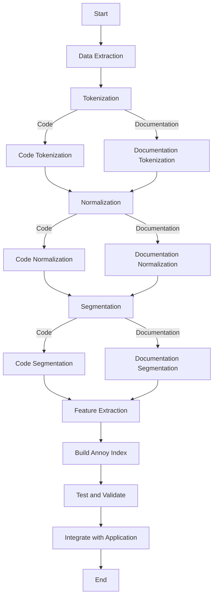

# Getting RAG running locally

_This document was generated primarily by GPT-4o._

Adding a Retrieval-Augmented Generation (RAG) implementation to your workflow, especially with a local embeddings provider, is an advanced and exciting step towards enhancing your project's capabilities. This involves integrating a system that retrieves relevant documents or data (using embeddings) and then generates responses based on both the retrieved information and the direct input. Given your background and requirements, here's a structured approach to achieve this:

### 1. Understanding RAG

First, ensure you have a solid understanding of how RAG works. RAG combines the power of pretrained language models (like those from GPT or BERT) with a retrieval system (often based on dense vector embeddings) to generate responses that are informed by a broader context or specific knowledge base.

### 2. Selecting an Embeddings Provider

For a local embeddings provider, you might consider options like Elasticsearch with dense vector support, FAISS (Facebook AI Similarity Search), or Annoy (Approximate Nearest Neighbors Oh Yeah) by Spotify. These systems allow you to store and retrieve embeddings efficiently. You'll need to:

- **Generate Embeddings**: Convert your dataset or knowledge base into embeddings. This step might involve using models like Sentence-BERT or similar to encode your text data into high-dimensional vectors.
- **Index Embeddings**: Use your chosen embeddings provider to index these vectors. This involves setting up the provider locally and creating an index for your embeddings.

### 3. Integration with Your Project

- **Data Preparation**: Ensure your data is in a format suitable for both embedding generation and retrieval. This might involve preprocessing steps like tokenization, normalization, and possibly segmentation.
- **Embedding Generation and Indexing**: Use a script or a pipeline to process your data, generate embeddings, and index them in your local embeddings provider.
- **Retrieval Mechanism**: Implement a retrieval mechanism that queries the embeddings provider based on input queries (or context) to fetch relevant documents or data points.
- **Augmentation and Generation**: Integrate the retrieval mechanism with your language model (e.g., GPT-4). This involves modifying the input to the language model to include retrieved information, thereby augmenting the generation process.

### 4. Software and Libraries

- **Language Model**: Utilize the OpenAI GPT API or a locally hosted model if you have access and resources.
- **Embeddings Generation**: Libraries like `sentence-transformers` can be used for generating embeddings.
- **Local Embeddings Provider**: Set up and utilize Elasticsearch, FAISS, or Annoy as your local embeddings provider. Each has its own setup and integration libraries (e.g., `elasticsearch-py`, `faiss`, `annoy`).
- **Integration**: Develop a custom integration layer that ties together the embeddings retrieval and the language model generation. This might involve custom code to handle the logic of combining retrieved content with the input query and formatting it for the language model.

### 5. Testing and Iteration

- **Prototype**: Start with a small subset of your data to prototype the entire RAG process. This allows you to debug and refine your approach without the overhead of processing your entire dataset.
- **Evaluation**: Evaluate the performance of your RAG system in terms of both retrieval accuracy and the quality of generated responses. You might need to adjust your embeddings model, retrieval thresholds, or the way retrieved information is used by the language model.

### 6. Deployment

Once you're satisfied with the prototype's performance, scale up your implementation to handle your full dataset. Ensure your local embeddings provider is configured to handle the load and that your integration layer is optimized for performance.

### 7. Documentation and Maintenance

Document your RAG implementation process, including data preparation steps, configurations for your embeddings provider, and custom code for integration. Regularly review and update your embeddings index as your data or knowledge base evolves.

This approach requires a blend of skills in natural language processing, software development, and system architecture. Given your expertise, you should be well-equipped to tackle the challenges of integrating RAG into your project."

# Preprocessing

Implementing a preprocessing pipeline for a code repository, especially for an application written in Rust along with its documentation, involves several steps designed to convert raw text into a format suitable for generating embeddings with Annoy (Approximate Nearest Neighbors Oh Yeah) by Spotify. The goal is to clean and structure the data in a way that maximizes the usefulness of the embeddings for retrieval tasks. Here's how you can approach it:

### 1. **Environment Setup**

First, ensure you have all necessary libraries and tools installed. For Rust code analysis and text processing in Python, you might need:

- Rust environment (for any Rust-specific processing).
- Python environment with libraries like `nltk` for natural language processing, `annoy` for building the Annoy index, and possibly `pygments` for syntax highlighting and tokenization of code.

### 2. **Data Extraction**

Extract all textual data from the code repository. This includes both the Rust source code and the documentation. You might want to separate code from documentation as they could be processed differently.

### 3. **Preprocessing Steps**

#### Tokenization:

- **Code**: Use a lexer appropriate for Rust, such as `pygments`, to tokenize the source code. This will split the code into syntactic units (tokens) like keywords, identifiers, literals, etc.
- **Documentation**: Use a natural language tokenizer from `nltk` to tokenize the documentation text into words.

#### Normalization:

- **Lowercasing**: Convert all text to lowercase to ensure consistency.
- **Removing Special Characters**: In documentation, remove special characters and punctuation. For code, decide based on whether such characters provide semantic meaning.
- **Stopwords Removal**: For documentation, remove stopwords using `nltk`'s stopwords list. For code, consider whether certain language-specific keywords (e.g., `fn` in Rust) should be treated as stopwords.
- **Stemming/Lemmatization**: For documentation, apply stemming or lemmatization to reduce words to their base or root form. This step is more relevant to natural language text than to code.

#### Segmentation:

- **Code**: Segment the code into logical units. This could be functions, modules, or classes, depending on the granularity you need.
- **Documentation**: Segment the documentation into paragraphs, sections, or topics.

### 4. **Feature Extraction**

Convert the preprocessed text into numerical vectors. For textual data like documentation, TF-IDF (Term Frequency-Inverse Document Frequency) vectors are a common choice. For code, you might explore more sophisticated embeddings that capture semantic meaning, such as those generated by models trained on code (e.g., CodeBERT).

### 5. **Building the Annoy Index**

- Use the `annoy` library to build an index of the embeddings. Annoy allows you to specify the number of trees for the forest (which impacts the trade-off between build time, index size, and query time), as well as the distance metric (e.g., Euclidean, Manhattan, Angular).
- Store metadata (like file names, function names, or documentation headers) alongside the embeddings in the index or in a separate lookup table to facilitate retrieval.

### 6. **Testing and Validation**

Before using the index in your application, test it with sample queries to ensure it retrieves relevant code and documentation segments. Adjust your preprocessing steps and Annoy parameters as needed based on performance.

### 7. **Integration**

Finally, integrate the Annoy index into your application. Implement a query interface that preprocesses query inputs in the same way as your index data, retrieves nearest neighbors from the Annoy index, and displays the results along with their metadata.

### Code Snippets and Tools

Here are some tools and libraries you might find useful:

- **Pygments** for code tokenization: [Pygments](https://pygments.org/)
- **NLTK** for natural language processing: [NLTK](https://www.nltk.org/)
- **Annoy** for building and querying the index: [Annoy on GitHub](https://github.com/spotify/annoy)

This pipeline will allow you to transform your Rust codebase and its documentation into a searchable format, leveraging Annoy's efficient nearest neighbor search capabilities to facilitate information retrieval.

## Summary

Here's a mermaid diagram summarizing the preprocessing pipeline for incorporating a code repository into an Annoy index for efficient retrieval:

